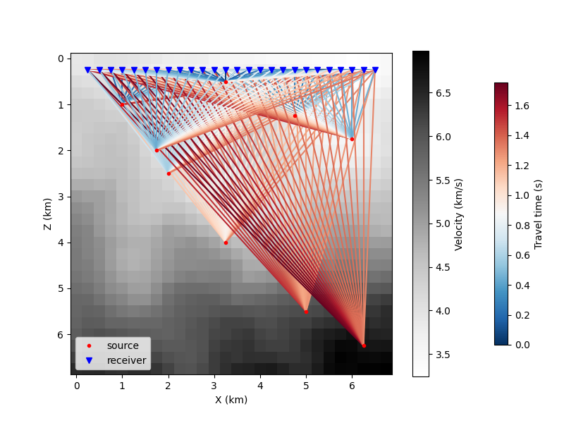
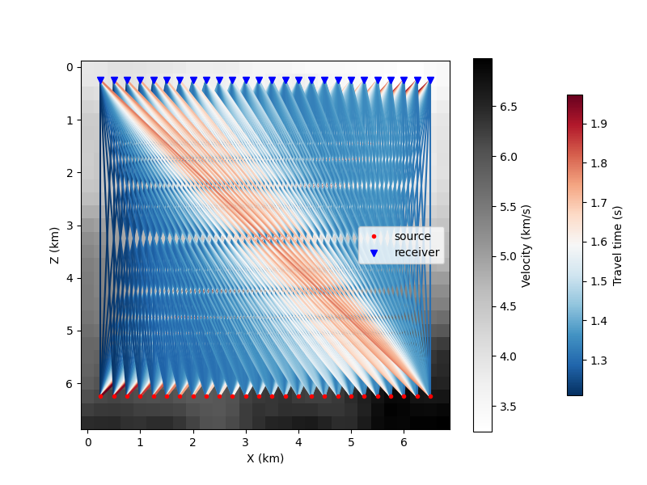

# Uncertainty Quanitification of Seismic Imaging using Neural Posterior Principal Components (NPPC)

This work explores the application of a novel method NPPC to quantify uncertainties in seismic imaging, which predicts principal components of the posterior distribution in a single forward pass from earthquake measurements.

The eikonal_models folder contains the main code, while the scripts folder contains the scripts for running the model. Since NPPC uses a trained restoration model, the main code has both a restoration model and NPPC model.

# Interactive Demo

An interactive demo *travel_time_nppc.ipynb* is added for demonstration. It is self contained notebook with results for the random geometry. It can be altered to use different datasets and geometries. 

# Requirements
## Environment 
A yaml file is provided. Please install the dependencies by:
```
conda env create -f uq-nppc-travel-time.yaml
```

## Data
Please download the data via [this link](https://drive.google.com/drive/u/0/folders/1Aie7Nkv8ip1VQESC6K6auG8jJBgzlS9M).
- **Two velocity datasets**:
    - **0.3FixedGradGRFSamples100000_28x28_1_1.5.npy**: velocity in km/s, (nx, nz, N) = (28, 28, 100000)
    - **0.3GradGRFSamples100000_28x28_1_1.5.npy**: velocity in km/s, (nx, nz, N) = (28, 28, 100000)
    - Pixel spacing: dx, dz = 0.25 km
      
- **Folders**: {velocity dataset}_{source-receiver geometry}
    - **{velocity dataset}_{rand}**
    
    - **{velocity dataset}_{transmission}**
    
        - SouPos.npy: Source pixel position, (nsrc, 2)
        - RecPos.npy: Receiver pixel position, (nrec, 2)
        - TT_0_to_N.npy: Travel time measurements in s, (nsrc, nrec, N) (N=100000, but you can use smaller Ns to start with)

See **visualize_data.ipynb** for reading and visualizing the data.

# Usage 
To run the code, use 

```bash
./scripts/run_model_pipeline.sh 
```
You will be prompted to choose a specific dataset "fixed_grad" or "grad" and geometry "rand" or "transmission". The rest of the arguments are located within the run_model_pipeline.sh that can be updated. 

# References
NPPC is adapted from:

Nehme, Elias, Yair, Omer, and Michaeli, Tomer. *Uncertainty Quantification via Neural Posterior Principal Components.* 
**arXiv:2309.15533**, 2023. NeurIPS 2023. 
[https://doi.org/10.48550/arXiv.2309.15533](https://doi.org/10.48550/arXiv.2309.15533)